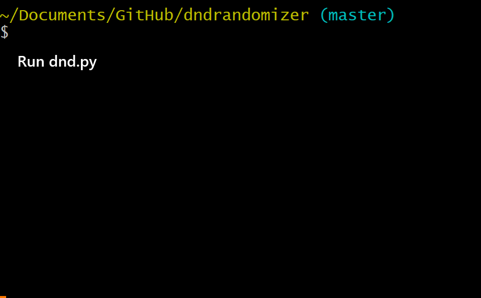

# DnD Randomizer   

Randomizes the stat rolls for a D&D character without needing dice!

## How to use

**1. Run [dnd.py](dnd.py)**

**2. Press the 'Roll' button**

**3. Get your stats!**

## Description
***Written on the 17th of Februrary 2020 by [41014](https://github.com/41014), updated on the 20th of Februrary 2020 by [RazerMoon](https://github.com/RazerMoon)***

I wanted to create something that I thought would be fairly simple to make as a beginner and might be useful to me in some way. I needed for there to be a GUI since I'm in love with the idea of making an application that I could give to someone else and allow them to easily use.

Tkinter was my only option, as I didn't want to venture off too far away from the bare essentials. Through developing this, I was able to familiarize myself with the scope of what one function could pack into a program, and just how long they could be.

The randomize() function inside of the "Roll" button first fixes the state of each Entry widget to "normal." Next, if the Entry is not empty then it will delete the contents. This check is in place because otherwise, the function will concatenate the number on each roll, making the result grow.
### Example:

|     Roll    | Value Generated | Value Displayed |
|:-----------:|:---------------:|:---------------:|
|  First Roll |        14       |        14       |
| Second Roll |        10       |       1014      |
|  Third Row  |        4        |      41014      |

After that, each stat is assigned the result of random.randint(1, 20). The range of 1-20 was chosen because the die used in Dungeons and Dragons to roll stats is the d20. Those variables are then inserted into each Entry widget and the numbers are displayed.

Finally, the Entry widgets' states are changed to "readonly," which prevents the randomized values in the boxes from being changed by the user. Pressing the "Roll" button again restarts the function, which changes the widgets back to the "normal" state. The widgets have to be changed from "normal" to "readonly" and back because Entry widgets in a "readonly" state do not update, but the changes are reflected if the state is "normal." Unfortunately, "normal" allows the user to type in the Entry widgets and change the results, which is undesireable behavior, so the widgets have to go back into the "readonly" state after the numbers are generated and displayed.

## Authors

* **[41014](https://github.com/41014)** - *Created project and files*
* **[RazerMoon](https://github.com/RazerMoon)** - *Rewrote code using loops for efficiency, improved README.MD*
